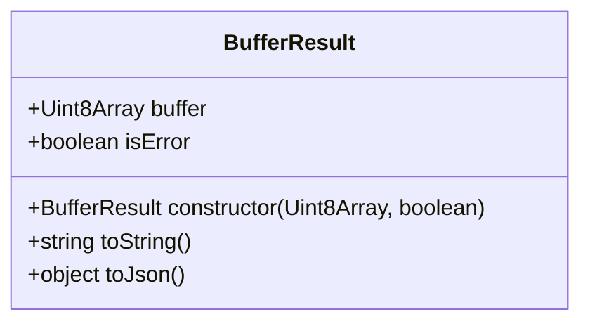

# WASI TinyGo JS Helpers

Build [TinyGo](https://tinygo.org/) functions for [Node.js](https://nodejs.org/) thanks to [WebAssembly](https://webassembly.org/) and the Node.js [WASI](https://wasi.dev/) support.

- `wasi-tinygo-js` is both a npm package and a Golang library.
- Why TinyGo? It's the only Go compiler that can build WASI compliant wasm modules

## Install

### Node.js
```bash
npm install wasi-tinygo-js@0.0.2
```

### Go
```go
import (
  "github.com/bots-garden/wasi-tinygo-js/wasihelpers"
)
```

## Create and build a wasm module (with TinyGo)

```go
package main

import (
	"github.com/bots-garden/wasi-tinygo-js/wasihelpers"
)

func main() {
	wasihelpers.SetHandler(Handler)
}

func Handler(param []byte) ([]byte, error) {

	message := "👋 Hello World 🌎" + string(param)
	return []byte(message), nil
}
```

**Build**:
```bash
tinygo build -o hello.wasm -target wasi ./hello.go
```

## Call the TinyGo Wasm function from Node.js

```javascript
import {WasmHelper, WasmModule} from 'wasi-tinygo-js'

(async () => {
  const wasm = await WasmHelper.compile("./hello.wasm")

  let wasmModule = new WasmModule(wasm)

  let success = await wasmModule.initialize()

  if(success) {

    let result = wasmModule.callHandlerWithString("John Doe")
    if(result.isError) {
      console.log("😡", result.toString())
    } else {
      console.log("🙂", result.toString())
    }
  }

})()
```
You can call the Go handler with 3 types:

- Bytes: `wasmModule.callHandlerWithBytes(new TextEncoder("utf8").encode("John Doe"))`
- String: `wasmModule.callHandlerWithString("John Doe")`
- JSON: `wasmModule.callHandlerWithJson({firstName: "John", lastName: "Doe"})`

The 3 `callHandler` methods return a `BufferResult` type:



👀 Have a look to the `/samples` directory

## Call the TinyGo Wasm function with WasmEdge, Wasmtime or Wasmer

If you want to execute the TinyGo wasm module with a WebAssembly Runtime, it's simple, update the `main` function like this:

```go
package main

import (
	"fmt"
	"github.com/bots-garden/wasi-tinygo-js/wasihelpers"
	"os"
	"path/filepath"
)

func main() {
	if filepath.Ext(os.Args[0]) == ".wasm" {
		value, _ := Handler([]byte(os.Args[1]))
		fmt.Println(string(value))
	} else {
		wasihelpers.SetHandler(Handler)
	}
}

func Handler(param []byte) ([]byte, error) {

	message := "👋 Hello World 🌎" + string(param)
	return []byte(message), nil
}
```

And now, you can run it like this:

```bash
wasmer wasm/hello.wasm "Jane"
wasmtime wasm/hello.wasm "Jane"
wasmedge wasm/hello.wasm "Jane"
```

## Files

> This is subject to change

👀 Have a look to the `/samples/hello-world-text` directory
